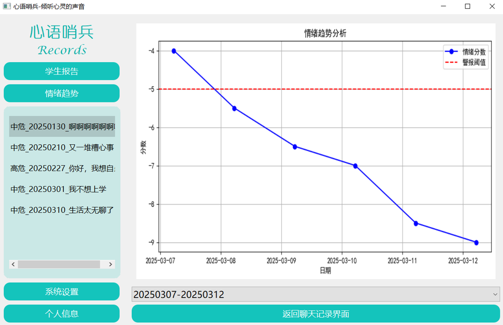

#### The "Heart Whisper Sentinel" youth psychological AI escort system is an innovative artificial intelligence mental health support platform specifically designed to meet the increasing mental health needs of teenagers. This system integrates a variety of cutting-edge technologies, such as artificial intelligence, big data analysis, speech recognition, natural language processing, and blockchain encryption technology, to provide comprehensive, personalized, and secure mental health services for teenagers. One of the core functions of the system is real-time psychological monitoring. It can analyze the emotional expressions, behavioral patterns, and psychological test results of teenagers through intelligent algorithms, thereby accurately identifying potential mental problems. For example, when teenagers exhibit emotional characteristics such as anxiety or depression during their interaction with the system, the system can quickly capture and generate warning information, alerting parents or school mental health counselors to pay attention and intervene in a timely manner.

  
  
  

<!-- Describe the problem, your approach, key results, and links to code/data. -->
