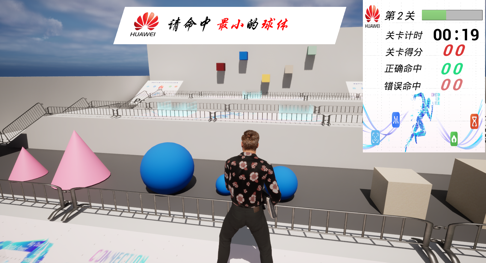
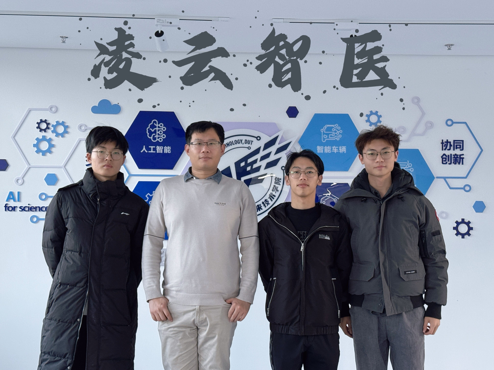

#### MindCare is an intelligent diagnosis system specifically focused on the mental health of teenagers. It integrates virtual reality and cloud technology to establish a local-cloud collaborative architecture. The front end conducts psychological assessments and collects multi-modal data from users. The "Lingyun Zhimedu" multi-modal large model developed by the cloud analyzes the data and generates personalized diagnosis reports, assisting experts during the diagnosis process. It also takes into account scientificity and privacy protection, and is applicable in educational and medical scenarios.

  
  
  

<!-- Describe the problem, your approach, key results, and links to code/data. -->
