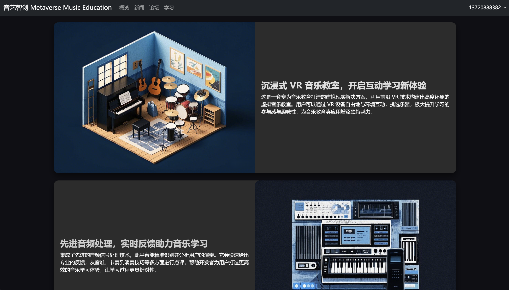
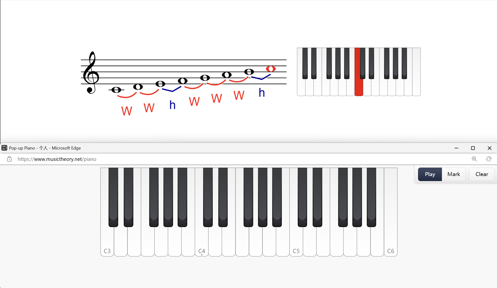

---

title: SonicArt-Intelligence v3.0
date: 2024-09-08
draft: false
weight: 20
summary: '"SonicArt-Intelligence" is an intelligent and immersive music
  education system designed for global music learners. '
links:
  - type: github
    name: github
    url: https://github.com/Wwwwwwjh/SonicArt-Intelligence.git
  - icon: hero/clipboard-document-check
    name: PDF
    url: /uploads/SonicArt-Intelligence.pdf
tags:
  - Project
---

#### "SonicArt-Intelligence" is an intelligent and immersive music education system designed for global music learners. Its aim is to establish a new generation of digital music learning ecosystem and create a brand-new learning environment for global music learners.

  
  
  
  

<!-- Describe the problem, your approach, key results, and links to code/data. -->
